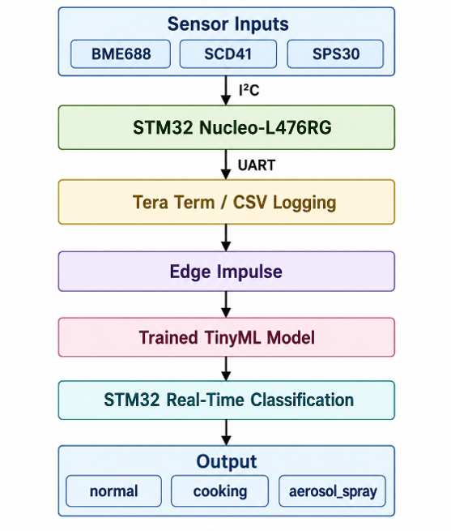

# TinyML-Based Indoor Environmental Monitoring System

## Overview


This project develops a low-cost embedded indoor environmental monitoring system using **multi-sensor fusion and TinyML-based classification**.

The system uses an **STM32 Nucleo-L476RG microcontroller** to collect environmental data from multiple sensors, process the data locally, and classify indoor conditions in real time.

Unlike traditional threshold-based air-quality monitoring systems, this project uses machine learning to identify patterns across multiple environmental parameters and classify different indoor events:

- Normal background conditions
- Cooking activity
- Aerosol spray usage

The trained TinyML model is deployed directly onto the STM32 microcontroller, enabling real-time edge inference without cloud processing.

---

# Key Features

- Real-time environmental monitoring
- Multi-sensor data fusion
- STM32 embedded firmware development
- TinyML neural network deployment
- Local machine learning inference
- UART-based live monitoring
- Dataset collection and processing
- Custom PCB design using KiCad

---

# System Architecture



# Hardware Components

## STM32 Nucleo-L476RG

The STM32 Nucleo-L476RG was selected as the embedded processing platform.

Features used:

- ARM Cortex-M4 processor
- STM32CubeIDE development environment
- STM32 HAL libraries
- I2C communication
- UART communication
- Embedded TinyML inference

---

# Environmental Sensors

## Bosch BME688

Measurements:

- Temperature
- Humidity
- Pressure
- Gas resistance

Purpose:

- Detect environmental and gas-related changes caused by indoor activities.

---

## Sensirion SCD41

Measurement:

- Carbon dioxide (CO₂)

Purpose:

- Provides ventilation and occupancy-related information.

---

## Sensirion SPS30

Measurements:

- PM1.0
- PM2.5
- PM4.0
- PM10
- Particle number concentration

Purpose:

- Detects particulate changes caused by cooking and aerosol events.

---

# Hardware Communication


| Component | Interface | STM32 Connection |
|---|---|---|
| BME688 | I2C | PB8/PB9 |
| SCD41 | I2C | PB8/PB9 |
| SPS30 | I2C | PB8/PB9 |
| PC Logging | UART | USART2 |

Communication settings:

```
I2C Speed: 100 kHz
UART Baud Rate: 115200
Sampling Interval: 5 seconds
```

---

# Firmware Development

The firmware was developed using:

- STM32CubeIDE
- STM32CubeMX
- STM32 HAL Drivers

## Firmware Workflow

1. Initialise STM32 peripherals
2. Configure I2C and UART communication
3. Detect connected sensors
4. Initialise sensor drivers
5. Read sensor measurements
6. Format sensor data
7. Output data through UART
8. Run TinyML classification

---

# Dataset Collection

A custom dataset was collected in a domestic kitchen environment.

The system was trained to classify three indoor conditions:

| Class | Description |
|---|---|
| Normal | Background indoor conditions |
| Cooking | Frying activity using an induction hob |
| Aerosol | Deodorant and air freshener spray |

## Dataset Summary

| Class | Number of Readings | Duration |
|---|---|---|
| Normal | 5267 | ~439 minutes |
| Cooking | 879 | ~73 minutes |
| Aerosol | 352 | ~29 minutes |

Sampling interval:

```
One reading every 5 seconds
```

---

# TinyML Model Development

The machine learning model was developed using **Edge Impulse**.

## Model Configuration

Input:

- 15 sensor features
- 60 second time windows
- 180 input features

Neural network:

```
Input Layer
      |
Dense Layer (20 neurons)
      |
Dense Layer (10 neurons)
      |
Output Layer (3 classes)
```

Classes:

```
0 - Aerosol
1 - Cooking
2 - Normal
```

---

# Model Performance

## Training Results

| Metric | Result |
|---|---|
| Training Accuracy | 99.06% |
| Validation Accuracy | 100% |
| Validation Loss | 0.0202 |

---

# Embedded Deployment

The trained model was exported as an embedded C/C++ library and deployed onto the STM32 microcontroller.

Deployment results:

| Resource | Usage |
|---|---|
| Model Type | int8 Quantised Neural Network |
| RAM Usage | 1.6 KB |
| Flash Usage | 17.8 KB |
| Estimated Latency | 1 ms |

---

# Real-Time Classification

The final STM32 prototype successfully performed live classification.

Example output:

```
CO2: 650 ppm
PM2.5: 14 ug/m3
Gas Resistance: 42000 Ohm

Prediction:
NORMAL

Confidence:
96%
```

Testing results:

| Condition | Result |
|---|---|
| Normal Room | Correct |
| Cooking | Correct |
| Aerosol Spray | Correct |

---

# PCB Design


A custom PCB was designed using **KiCad** to improve hardware integration.

Design process:

- Schematic capture
- Component selection
- PCB layout
- Routing
- Electrical Rule Check (ERC)
- Design Rule Check (DRC)

PCB features:

- STM32 interface
- Sensor connectors
- 3.3V and 5V power distribution
- Modular sensor connections

---

# Repository Structure

```
│
├── Core/
│ ├── Inc/
│ └── Src/
│ └── STM32 application firmware
│
├── Drivers/
│ └── STM32 HAL libraries and sensor drivers
│
├── Release/
│ └── Compiled firmware build files
│
├── docs/
│ └── Project documentation and images
│
├── media/
│ └── Project demonstration images/videos
│
├── ml/
│ ├── Dataset/
│ ├── Edge_Impulse/
│ └── Model training files
│
├── pcb/
│ └── KiCad schematic and PCB design files
│
├── TEST.ioc
│ └── STM32CubeMX configuration file
│
├── .project
├── .cproject
│
├── STM32L476RGTX_FLASH.ld
├── STM32L476RGTX_RAM.ld
│
└── README.md
```

---

# Technologies Used

## Embedded Systems

- STM32 Nucleo-L476RG
- ARM Cortex-M4
- STM32CubeIDE
- STM32 HAL
- I2C
- UART

## Sensors

- Bosch BME688
- Sensirion SCD41
- Sensirion SPS30

## Machine Learning

- TinyML
- Edge Impulse
- Neural Networks
- int8 Quantisation

## Hardware Design

- KiCad
- PCB Design
- Embedded Hardware Integration

---

# Limitations

Current limitations:

- Dataset collected from one indoor environment
- Limited aerosol training samples
- Sensor behaviour may vary between locations
- Not a certified air-quality or safety monitoring device
- PCB designed but not manufactured

---

# Future Improvements

Potential improvements:

- Collect larger datasets from different environments
- Add more indoor activity classes
- Add wireless connectivity (BLE/Wi-Fi)
- Develop mobile monitoring application
- Create battery-powered version
- Manufacture and test the PCB
- Compare against traditional threshold systems

---

# Project Outcome

This project demonstrates the use of **TinyML for intelligent embedded environmental monitoring** by combining:

- Sensor fusion
- Embedded firmware
- Machine learning
- Edge inference
- Hardware design

The final prototype successfully collected environmental data, trained a classification model, deployed the model onto an STM32 microcontroller, and performed real-time indoor condition classification.

---

# Author

Atiq Mufaqqir

## License

This project is intended for educational purposes as part of the ELEC3875 Individual Engineering Project.

